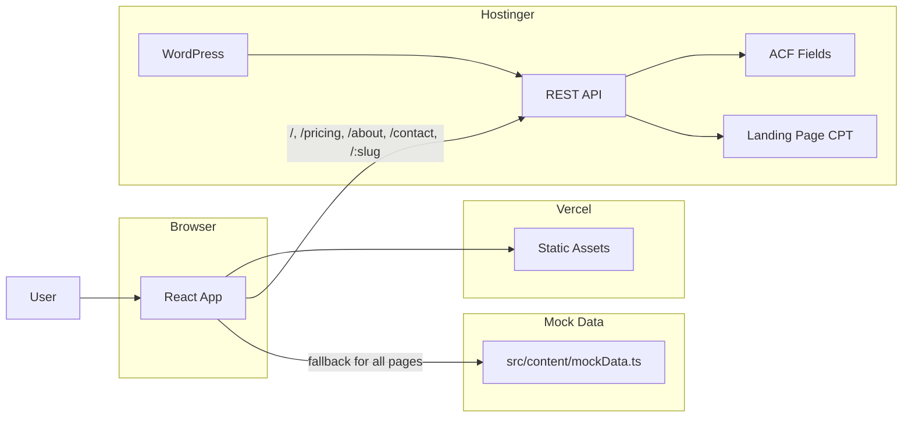
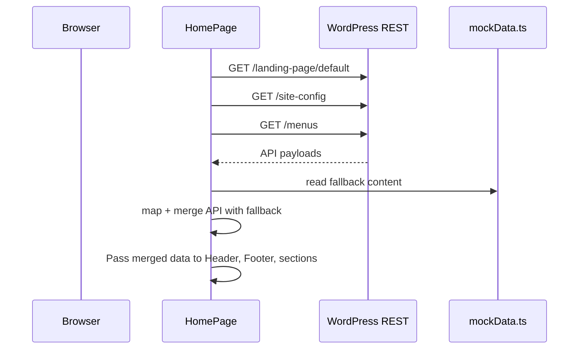
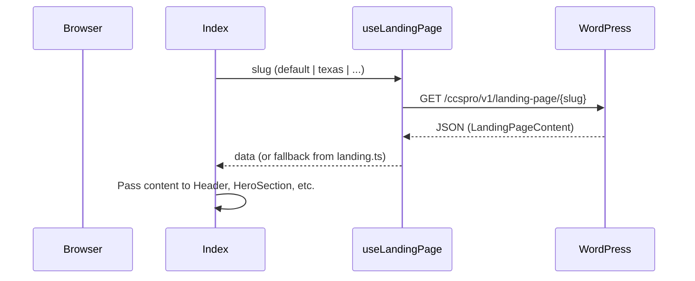
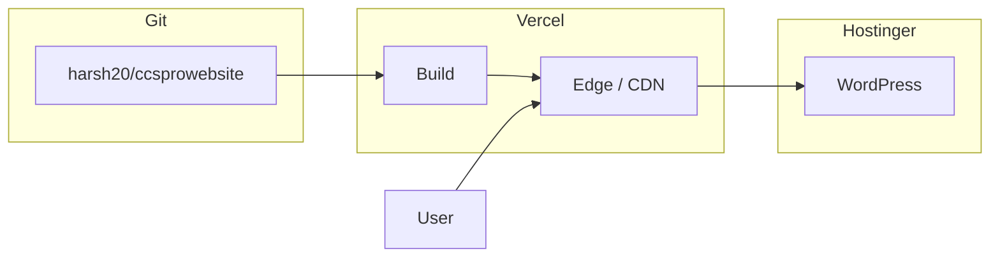

# CCS Pro Marketing Site — Architecture

## 1. System overview

The system is a **headless CMS** setup: a static React frontend (Vercel) consumes content from a WordPress REST API (Hostinger). There is no server-side rendering; all content is fetched at runtime in the browser.

**Current status:** All four page templates (Home, Pricing, About, Contact) now use WordPress API with typed mock fallbacks. The legacy `/:slug` route fetches from WordPress. Phase 2 MU-plugin and provider/type/hook patches are applied in-repo.



---

## 2. Domains and hosting

| Layer | Domain | Hosting | Role |
|-------|--------|---------|------|
| Frontend | ccsprocert.com | Vercel | Serves the React SPA (HTML, JS, CSS). |
| CMS / API | wpcms.ccsprocert.com | Hostinger | WordPress admin + REST API (content and site-config). |

- DNS: GoDaddy, managed via CloudFlare. A record for `wpcms` points to Hostinger; root/www point to Vercel.
- All API calls from the frontend are cross-origin (ccsprocert.com → wpcms.ccsprocert.com). CORS is configured in the WordPress MU-plugin.

---

## 3. Frontend architecture

### 3.1 Stack

- **Runtime:** React 18, TypeScript.
- **Build:** Vite.
- **Routing:** React Router (`/`, `/pricing`, `/about`, `/contact`, `/:slug`, `*`).
- **Data:** TanStack Query (`/:slug`, `landing-page/default`, `page/pricing`, `page/about`, `page/contact`, `site-config`, `menus`), typed mock fallbacks for all pages.
- **UI:** Tailwind CSS, shadcn/ui (Radix primitives), Lucide icons.

### 3.2 Entry and routing flow

```mermaid
flowchart TD
    Load[Page Load] --> FetchConfig[Fetch site-config]
    FetchConfig --> Loading{comingSoon === null?}
    Loading -->|yes| Splash[Blank splash div]
    Loading -->|no| CSCheck{comingSoon === true?}
    CSCheck -->|yes| ShowCS[Render ComingSoon]
    CSCheck -->|no| Router[React Router]
    Router --> Home[/ → HomePage]
    Router --> Pricing[/pricing → PricingPage]
    Router --> About[/about → AboutPage]
    Router --> Contact[/contact → ContactPage]
    Router --> Slug[/:slug → Index]
    Router --> NotFound["* → NotFound"]
    Home --> HomeAPI[useLandingPage("default"), useSiteConfig, useMenus]
    HomeAPI --> WPAPIHome[WordPress API]
    Home --> MockData[mockData.ts fallback]
    Slug --> UseLanding[useLandingPage]
    UseLanding --> WPAPI[WordPress API]
    WPAPI --> Fallback[or static fallback]
    Pricing --> PricingAPI[usePricingPage, useSiteConfig, useMenus]
    PricingAPI --> WPAPI
    Pricing --> MockData
    About --> AboutAPI[useAboutPage, useSiteConfig, useMenus]
    AboutAPI --> WPAPI
    About --> MockData
    Contact --> ContactAPI[useContactPage, useSiteConfig, useMenus]
    ContactAPI --> WPAPI
    Contact --> MockData
```

- **App.tsx:** On mount, fetches `GET /ccspro/v1/site-config`. Initial state uses `buildTimeComingSoon` if available; while loading (`null`), renders a blank splash to avoid flashing the Coming Soon page. Routes are ordered so `/pricing`, `/about`, `/contact` take priority over `/:slug`.
- **HomePage (`/`):** Fetches `landing-page/default`, `site-config`, and `menus`, then merges that data with `mockData.ts` fallbacks before rendering sections. Header now consumes `site-config` logo fields (`logoUrl`, `logoText`) with fallback behavior.
- **Other named pages (PricingPage, AboutPage, ContactPage):** Fetch from `page/pricing`, `page/about`, `page/contact`, `site-config`, and `menus` with `mockData.ts` fallback. Each renders a global Header and Footer plus page-specific sections. Each sets `document.title` via `useEffect`.
- **Legacy route (Index):** Resolves slug from `useParams()`, calls `useLandingPage(slug)`, shows skeleton while loading, then passes content into section components.

### 3.3 Data flow — homepage (`/`) with API + fallback



Homepage content is API-driven with fallback. Pricing, About, and Contact now follow the same API-first + mock fallback pattern (`usePricingPage`, `useAboutPage`, `useContactPage` with `mockData.ts` fallback). Both `heroContent` (including `headlineSuffix`) and `heroDashboard` use this pattern in `HomePage.tsx`.

### 3.4 Data flow — legacy route (WordPress)



### 3.5 Key frontend files

| Path | Responsibility |
|------|-----------------|
| `src/App.tsx` | Site-config fetch, coming-soon gate with flash fix, router with 6 routes. |
| `src/pages/HomePage.tsx` | Homepage — fetches `landing-page/default`, `site-config`, `menus`; maps/merges with fallback; renders hero, pain point, how it works, ecosystem, CTAs, pricing, support, FAQ. |
| `src/components/landing/Header.tsx` | Global header with route-aware nav/CTA and dynamic logo resolution (`logoUrl` -> static asset -> text fallback). |
| `src/pages/PricingPage.tsx` | Pricing — fetches `page/pricing`, `site-config`, `menus`; API + fallback. Hero, extended cards, feature comparison table, FAQ, CTA. |
| `src/pages/AboutPage.tsx` | About — fetches `page/about`, `site-config`, `menus`; API + fallback. Hero, mission, why Texas, differentiators, CTA. |
| `src/pages/ContactPage.tsx` | Contact — fetches `page/contact`, `site-config`, `menus`; API + fallback. Hero, form, contact info, group callout. |
| `src/pages/Index.tsx` | Legacy WP-driven landing; uses useLandingPage(slug), imports archived components. |
| `src/content/mockData.ts` | All mock data for new pages, typed against `wordpress.ts` interfaces. |
| `src/content/landing.ts` | Static fallback for `/:slug` route. |
| `src/types/wordpress.ts` | TypeScript interfaces for all content structures (legacy + new). |
| `src/lib/wordpress.ts` | getLandingPage(slug), getSiteConfig() — API client (page fetches go through providers). |
| `src/hooks/useWordPress.ts` | useLandingPage(slug), useSiteConfig(), useMenus(), usePricingPage(), useAboutPage(), useContactPage() — React Query wrappers. |
| `src/lib/landing-icons.ts` | Map icon name strings to Lucide components (33 icons). |
| `src/components/landing/*` | All presentational section components. |
| `src/components/landing/archived/*` | 7 components removed from homepage, preserved for future use. |

### 3.6 Component architecture

```
Page (e.g. HomePage)
├── Header (headerData)
├── <main>
│   ├── HeroSection (heroData, dashboardData)
│   ├── ProblemOutcome (painPointData)
│   ├── HowItWorks (tabData) — uses shadcn Tabs
│   ├── EcosystemSection (data)
│   ├── FinalCTA (blockData, style=indigo)
│   ├── HomePricingSection (provider, group)
│   ├── FinalCTA (blockData, style=emerald)
│   ├── SupportSection (channelData)
│   └── FAQSection (faqData)
└── Footer (footerData)
```

Each section component accepts both a legacy `content?: LandingPageContent` prop (for `/:slug` route) and new typed props (for new pages). The component internally branches on which prop is present.

---

## 4. Backend (WordPress) architecture

> **Note:** WordPress was NOT modified in Phase 1. This section documents the existing backend.

### 4.1 Role of WordPress

- **Content store:** All copy, CTAs, pricing, FAQ, etc. for each landing variant live in WordPress.
- **API:** Exposes content via custom REST routes under `ccspro/v1`.

### 4.2 Custom post type: Landing Page

- **Slug:** `landing_page`.
- **Usage:** One published post per landing variant (e.g. `default`, `texas`).
- **Fields:** ACF field groups attached to this CPT, organized by section.

### 4.3 REST API

| Method | Route | Purpose |
|--------|-------|---------|
| GET | /wp-json/ccspro/v1/site-config | Returns `comingSoon` plus global `header` and `footer` settings. |
| GET | /wp-json/ccspro/v1/menus | Returns `primaryNav`, `footerCol1`, `footerCol2`, `footerCol3` from WP menu locations. |
| GET | /wp-json/ccspro/v1/landing-page/{slug} | Returns full landing content for the specified variant, including pricing v2 card data, tabbed how-it-works arrays, and ecosystem content. |
| GET | /wp-json/ccspro/v1/page/pricing | Returns PricingPageContent from ACF Options (Pricing Page sub-page). |
| GET | /wp-json/ccspro/v1/page/about | Returns AboutPageContent from ACF Options (About Page sub-page). |
| GET | /wp-json/ccspro/v1/page/contact | Returns ContactPageContent from ACF Options (Contact Page sub-page). |

- **Namespace:** `ccspro/v1`. Registered in the MU-plugin.
- **CORS:** Allows ccsprocert.com and localhost origins.

### 4.4 Coming soon control

- **Storage:** WordPress option `ccspro_coming_soon`.
- **Admin UI:** Settings → CCS Pro Site → checkbox.
- **API:** `GET /ccspro/v1/site-config` → `{ "comingSoon": boolean }`.

### 4.5 MU-plugin (`ccspro.php` loader + `ccspro/` modules)

- `wordpress/mu-plugins/ccspro.php` is the MU-plugin loader entrypoint.
- `wordpress/mu-plugins/ccspro/cpt.php` registers `landing_page`, nav menus, and landing-page admin UX customizations.
- `wordpress/mu-plugins/ccspro/admin.php` adds Settings → CCS Pro Site (coming-soon checkbox).
- `wordpress/mu-plugins/ccspro/cors.php` adds CORS headers and OPTIONS preflight handling.
- `wordpress/mu-plugins/ccspro/acf.php` registers all ACF options pages and field groups.
- `wordpress/mu-plugins/ccspro/rest-api.php` registers REST routes: `site-config`, `menus`, `landing-page/(?P<slug>[a-z0-9\-]+)`, `page/pricing`, `page/about`, `page/contact`.

---

## 5. Type system

### 5.1 Legacy types (for `/:slug` route)

`LandingPageContent` — monolithic interface containing all section data for a single landing page variant. Used by `Index.tsx` and all section components in their `content` prop path.

### 5.2 New and updated types (Phase 1 + Phase 2 integration)

Core page types defined in `src/types/wordpress.ts`:

| Interface | Used by |
|-----------|---------|
| `MenuLink`, `CtaLink` | Header, Footer navigation |
| `HeaderData` | Header component (`logo` text + optional `logoUrl`) |
| `FooterColumn`, `FooterData` | Footer component |
| `SiteSettings` | Top-level container (header + footer) |
| `HeroContent` (`headline`, `headlineHighlight`, `headlineSuffix`, `subheadline`, CTAs, `trustIndicators`), `HeroDashboard` | HeroSection |
| `PainPointContent` | ProblemOutcome |
| `HowItWorksTabContent` | HowItWorks (tabbed) |
| `EcosystemPair`, `EcosystemContent` | EcosystemSection |
| `HomePricingCardData` | HomePricingSection |
| `CtaBlockContent` | FinalCTA (indigo/emerald variants) |
| `SupportChannel`, `SupportSectionContent` | SupportSection |
| `HomePageContent` | HomePage aggregate |
| `PricingPlanExtended`, `FeatureComparisonRow`, `FeatureComparisonCategory`, `PricingPageContent` | PricingPage |
| `AboutPageContent` | AboutPage |
| `ContactPageContent` | ContactPage |

No new types were added for this integration; existing types are now used by the API responses for `page/pricing`, `page/about`, `page/contact`.

Additional integration types now used by homepage/provider wiring:

| Interface | Used by |
|-----------|---------|
| `PricingCardData`, `PricingContentV2` | New WordPress pricing schema (`providerCard` / `groupCard`) |
| `GlobalHeaderData`, `GlobalFooterData`, `SiteConfigResponse` | Site-config endpoint payload |
| `MenusResponse` | Menus endpoint payload |

---

## 6. Deployment architecture



- **Frontend:** GitHub → Vercel builds on push → serves `dist/` with SPA rewrite. Env `VITE_WP_API_URL` set in Vercel.
- **Backend:** WordPress + MU-plugin on Hostinger at wpcms.ccsprocert.com. Permalinks = "Post name".

---

## 7. Security and CORS

- **CORS:** Configured frontend origins include `https://ccsprocert.com`, `https://www.ccsprocert.com`, `http://localhost:5173`, `http://localhost:3000`, and `http://127.0.0.1:5173`.
- **API:** Public read-only; no auth required for site-config or landing-page.
- **Secrets:** No API keys in the frontend; env vars are build-time and point to public URLs.

---

## 8. Phase 2 outlook (future)

Phase 2 is largely complete for named pages: Pricing, About, and Contact now use WordPress API with mock fallback. Remaining gap:
- **HomePage sections:** `painPoint`, `ctaBlockA`, `ctaBlockB` still use mock data; the existing ACF schema uses a legacy format that doesn't match the new component props. Wiring them would require new ACF fields.

Future work:
- Migrate remaining HomePage sections to API when ACF schema is updated.
- Potential GraphQL cutover (WPGraphQL is stubbed in the content providers).

---

## 9. References

- **context.md** — Repo layout, what was done, env vars, handy URLs.
- **requirements.md** — Functional and non-functional requirements.
- **claude.md** — AI assistant project rules and conventions.
- **docs/WORDPRESS_SETUP_GUIDE.md** — Step-by-step WordPress and CMS setup.
