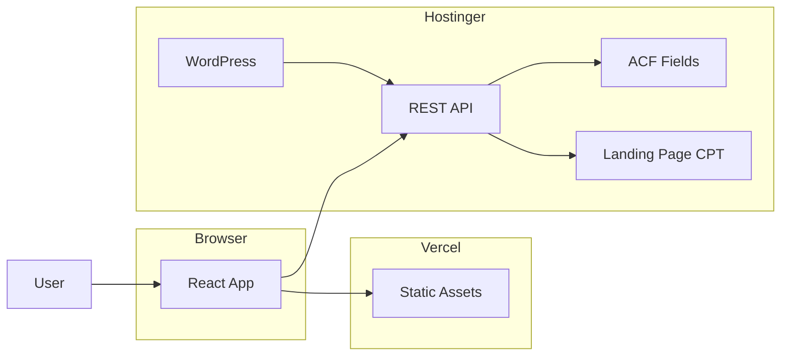
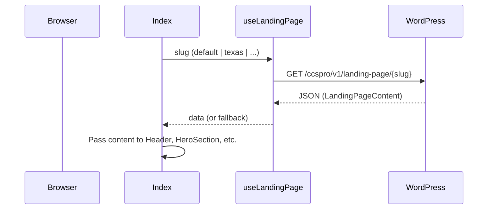
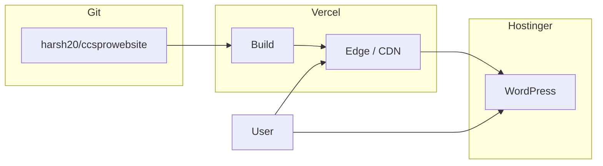

# CCS Pro Landing Page — Architecture

## 1. System overview

The system is a **headless CMS** setup: a static React frontend (Vercel) consumes content from a WordPress REST API (Hostinger). There is no server-side rendering; all content is fetched at runtime in the browser.



---

## 2. Domains and hosting

| Layer | Domain | Hosting | Role |
|-------|--------|---------|------|
| Frontend | ccsprocert.com | Vercel | Serves the React SPA (HTML, JS, CSS). |
| CMS / API | wpcms.ccsprocert.com | Hostinger | WordPress admin + REST API (content and site-config). |

- DNS: GoDaddy, managed via CloudFlare. A record for `wpcms` points to Hostinger; root/www for the site point to Vercel.
- All API calls from the frontend are cross-origin (ccsprocert.com → wpcms.ccsprocert.com). CORS is configured in the WordPress MU-plugin to allow the frontend origin.

---

## 3. Frontend architecture

### 3.1 Stack

- **Runtime:** React 18, TypeScript.
- **Build:** Vite.
- **Routing:** React Router (/, /:slug).
- **Data:** TanStack Query (useLandingPage), fetch for site-config.
- **UI:** Tailwind CSS, shadcn/ui (Radix primitives), Lucide icons.

### 3.2 Entry and routing flow

```mermaid
flowchart TD
    Load[Page Load] --> FetchConfig[Fetch site-config]
    FetchConfig --> ComingSoon{comingSoon?}
    ComingSoon -->|true| ShowCS[Render ComingSoon page]
    ComingSoon -->|false or timeout| Router[React Router]
    Router --> Root[/]
    Router --> Slug[/:slug]
    Root --> Index[Index page]
    Slug --> Index
    Index --> UseLanding[useLandingPage slug]
    UseLanding --> FetchContent[Fetch landing-page slug]
    FetchContent --> Skeleton{loading?}
    Skeleton -->|yes| SkeletonUI[LandingPageSkeleton]
    Skeleton -->|no| Content[LandingPageContent]
    Content --> Sections[Header, Hero, Features, Pricing, FAQ, Footer, etc.]
```

- **App.tsx:** On mount, fetches `GET /ccspro/v1/site-config`. If `comingSoon === true`, renders only `ComingSoon`; otherwise mounts `BrowserRouter` and normal routes. Timeout 8s then treat as “not coming soon” and show full site.
- **Routes:** `/` and `/:slug` both render the same `Index` page. Slug defaults to `default` when missing.
- **Index:** Resolves slug from `useParams()`, calls `useLandingPage(slug)`, shows skeleton while loading, then passes API (or static fallback) content into each section component.

### 3.3 Data flow (landing content)



- **Landing content** shape is defined in `src/types/wordpress.ts` and matches the JSON returned by the WordPress custom endpoint. Section components receive optional `content?: LandingPageContent` and use the slice they need (e.g. `content?.heroContent`), with fallback to static data from `src/content/landing.ts` when content is missing or the API fails.

### 3.4 Key frontend files

| Path | Responsibility |
|------|-----------------|
| src/App.tsx | Site-config fetch, coming-soon gate, router wrapper. |
| src/pages/Index.tsx | Slug resolution, useLandingPage(slug), skeleton, composition of all landing sections. |
| src/lib/wordpress.ts | getLandingPage(slug), getSiteConfig(); base URL from VITE_WP_API_URL. |
| src/hooks/useWordPress.ts | useLandingPage(slug) with React Query (stale time ~5 min). |
| src/types/wordpress.ts | TypeScript interfaces for LandingPageContent and nested types. |
| src/content/landing.ts | defaultLandingPageContent used when API fails. |
| src/lib/landing-icons.ts | Map icon name strings to Lucide components for CMS-driven icons. |
| src/components/landing/* | Presentational sections; each accepts optional content and uses getLandingIcon where needed. |

---

## 4. Backend (WordPress) architecture

### 4.1 Role of WordPress

- **Content store:** All copy, CTAs, pricing, FAQ, etc. for each landing variant live in WordPress.
- **API:** Exposes that content via custom REST routes under `ccspro/v1`. No WordPress theme is used for the public site; the frontend is a separate SPA.

### 4.2 Custom post type: Landing Page

- **Slug:** `landing_page`.
- **Usage:** One published post per landing variant. Post slug is the variant identifier (e.g. `default`, `texas`).
- **Fields:** All section data is stored in ACF field groups attached to this CPT. Groups are organized by section (Site Config, Nav, Hero, Verification, Founder, Problem/Outcome, How It Works, Features, Packet Preview, Security, CAQH Concierge, Pricing, Support, Team, FAQ, Final CTA, Footer). ACF Free only; no Options Pages.

### 4.3 REST API

| Method | Route | Purpose |
|--------|-------|---------|
| GET | /wp-json/ccspro/v1/site-config | Returns `{ "comingSoon": true \| false }`. Value comes from option `ccspro_coming_soon`. |
| GET | /wp-json/ccspro/v1/landing-page/{slug} | Returns full landing content for the post with that slug. Response shape matches frontend `LandingPageContent`. |

- **Namespace:** `ccspro/v1`. Registered in the MU-plugin.
- **CORS:** Same MU-plugin sends `Access-Control-Allow-Origin` for ccsprocert.com and localhost so the frontend can call the API.
- **Transformation:** The landing-page endpoint reads ACF data from the post and maps it into the JSON structure expected by the frontend (camelCase keys, nested objects/repeaters as in `landing.ts`).

### 4.4 Coming soon control

- **Storage:** WordPress option `ccspro_coming_soon` (`'1'` = coming soon, `'0'` = live).
- **Admin UI:** Settings → CCS Pro Site. Checkbox “Coming soon mode” updates the option; no redeploy required.
- **API:** `GET /ccspro/v1/site-config` reads the option and returns `{ "comingSoon": boolean }`.

### 4.5 MU-plugin (ccspro-cpt-acf.php)

- Registers CPT `landing_page`.
- Registers all ACF field groups for landing sections (programmatic; no JSON import).
- Registers REST routes: `site-config`, `landing-page/(?P<slug>[a-z0-9\-]+)`.
- Adds CORS headers and OPTIONS handling for the allowed origins.
- Adds Settings → CCS Pro Site and the coming-soon checkbox.

---

## 5. Data model (conceptual)

- **Site config:** Single global flag (coming soon on/off).
- **Landing page:** One document per variant. Each document contains:
  - Site config slice (name, tagline, description),
  - Nav (links + CTAs),
  - Hero (copy + dashboard mock),
  - Verification, Founder, Problem/Outcome, How It Works, Features, Packet Preview, Security, CAQH Concierge, Pricing, Support, Team, FAQ, Final CTA, Footer.

Repeaters and groups in ACF map to arrays and nested objects in the API response; icon names and similar stay as strings and are resolved on the frontend (e.g. via `getLandingIcon()`).

---

## 6. Deployment architecture



- **Frontend:** Source in GitHub (remote `other` → harsh20/ccsprowebsite). Vercel builds on push (e.g. `npm run build`), serves `dist/` and SPA rewrite. Env var `VITE_WP_API_URL` points to `https://wpcms.ccsprocert.com/wp-json`.
- **Backend:** WordPress (and the MU-plugin) live on Hostinger at wpcms.ccsprocert.com. Permalinks must be “Post name” so REST routes work. ACF and ACF to REST API (or equivalent exposure) required for the custom endpoint to return ACF data.

---

## 7. Security and CORS

- **CORS:** Only the configured frontend origins (ccsprocert.com, www, localhost) are allowed. Configured in the MU-plugin.
- **API:** Public read-only; no auth required for site-config or landing-page. No sensitive data in these responses.
- **Secrets:** No API keys in the frontend; env vars (e.g. VITE_WP_API_URL) are build-time and visible in the client bundle. They only point to public URLs.

---

## 8. References

- **context.md** — Repo layout, what was done, env vars, handy URLs.
- **requirements.md** — Functional and non-functional requirements.
- **docs/WORDPRESS_SETUP_GUIDE.md** — Step-by-step WordPress and CMS setup.
