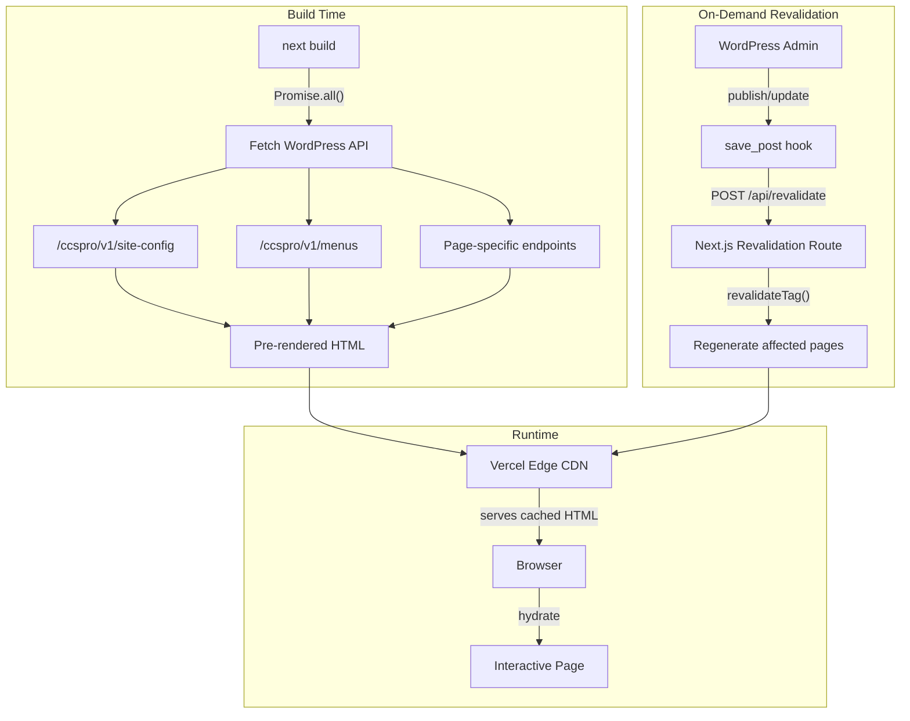
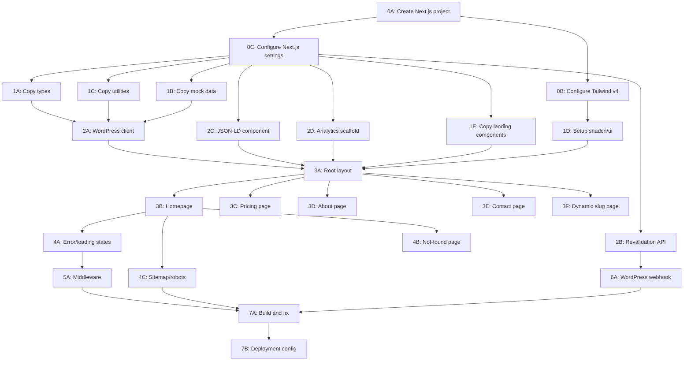

# Next.js Migration Plan — CCS Pro (Rev 5)

## Revision History

- **Rev 1:** Initial plan — 10 gaps found and fixed vs original
- **Rev 2:** 7 additional gaps found by user review (Gaps 11-19) — partial data fallback, slug discovery, webhook reliability, middleware exclusions, preview URLs, rate limiting, TypeScript strictness, Cards.tsx audit
- **Rev 3:** 7 structural issues fixed — JSON-LD dependency ordering, deletion/unpublish hooks, slug pagination, build-resilient try/catch, font cross-check, revalidatePath cost docs, server-only scope note
- **Rev 4:** 7 final gaps (Gaps 20-26) — analytics scaffold, async webhook retry, deepMerge runtime guard, generateMetadata fallback, transition_post_status guard, canonical tags, DNS rollback procedure
- **Rev 5:** 6 gaps (Gaps 27-32) — WPImage wrapper for next/image dimensions, draft preview (post-migration), sitemap static route comment, dynamic remotePatterns hostname, Server Action return type, robots.ts staging block

## Gaps Found in Rev 1 (Original Plan)

### Gap 1: No error boundary or loading state convention

**Source:** [Next.js App Router file conventions](https://nextjs.org/docs/app/api-reference/file-conventions/not-found)
**Fix:** Add `error.tsx` and `loading.tsx` at root and `[slug]` segments.

### Gap 2: No structured data (JSON-LD)

**Source:** [Next.js JSON-LD guide](https://nextjs.org/docs/app/guides/json-ld)
**Fix:** Add Organization, Service, FAQPage, ContactPoint schemas.

### Gap 3: No on-demand revalidation endpoint

**Source:** [On-demand ISR with webhooks](https://readmedium.com/how-to-use-webhook-in-next-js-on-demand-isr-38009604595c)
**Fix:** Add `app/api/revalidate/route.ts` with secret-protected `revalidateTag()`.

### Gap 4: No `next/image` configuration for remote WordPress images

**Source:** [Next.js remote image config](https://nextjs.org/docs/app/api-reference/config/next-config-js/images)
**Fix:** Configure `remotePatterns` for `wpcms.ccsprocert.com`.

### Gap 5: Tailwind v4 migration not addressed

**Source:** [Tailwind v3→v4 upgrade guide](https://tailwindcss.com/docs/upgrade-guide)
**Fix:** Dedicated task for CSS-first `@theme` migration.

### Gap 6: No parallel data fetching

**Source:** [Next.js composition patterns](https://nextjs.org/docs/app/building-your-application/rendering/composition-patterns)
**Fix:** `Promise.all()` in Server Components.

### Gap 7: No `dynamicParams` configuration for `[slug]`

**Source:** [generateStaticParams docs](https://nextjs.org/docs/app/api-reference/functions/generate-static-params)
**Fix:** `dynamicParams = true` for on-demand rendering of new slugs.

### Gap 8: No WordPress webhook for revalidation

**Source:** [WordPress + Next.js ISR pattern](https://awplife.com/headless-wordpress-next-js-wpgraphql-setup/)
**Fix:** MU-plugin hook on `save_post` / `acf/save_post`.

### Gap 9: No `Suspense` boundaries

**Source:** [Streaming SSR guide](https://www.hashbuilds.com/articles/next-js-15-streaming-ssr-complete-implementation-guide-2025)
**Fix:** `<Suspense>` with skeleton fallbacks.

### Gap 10: Missing `NavLink` rewrite and link audit

**Fix:** All `react-router-dom` `<Link to="">` and `useLocation` → `next/link` and `usePathname`.

---

## Gaps Found in Rev 2 (User Review)

### Gap 11: No per-field defensive fallback for partial WordPress data

**Problem:** The current fallback pattern is binary — API works or it doesn't. If WordPress returns a response but a field is `null`/`undefined`/malformed, the component crashes mid-render. This is especially dangerous for `[slug]` where content structure is less predictable.
**Finding:** Confirmed — current `HomePage.tsx` uses `landingData?.heroContent?.headline ? mapApiHeroToMock(...) : mockHomePage.hero` which only checks the top-level field. If `heroContent` exists but `headline` is `null`, the mapper receives bad data.
**Fix:** The WordPress client (`lib/wordpress.ts`) will implement a `deepMerge(apiData, mockFallback)` utility that recursively fills missing/null fields from mock data. Every fetch function returns guaranteed-complete data, not a maybe-null response. This is handled in **Task 2A**.

### Gap 12: `generateStaticParams` has no source for slug list beyond "default"

**Problem:** Task 3F says "at minimum `[{ slug: 'default' }]`" but doesn't define where the full slug list comes from.
**Finding:** The `landing_page` CPT has `show_in_rest: true` (cpt.php line 29), so the standard WordPress endpoint `/wp/v2/landing_page?_fields=slug&per_page=100` is available and returns all published landing page slugs. No custom endpoint needed.
**Fix:** `generateStaticParams` in Task 3F will call `/wp/v2/landing_page?_fields=slug&per_page=100` at build time. The WordPress client in Task 2A will expose a `getPublishedSlugs()` function for this. Wrapped in try/catch with `[{ slug: "default" }]` as minimum fallback.

### Gap 13: No retry logic or error logging for WordPress revalidation webhook

**Problem:** If the POST from WordPress `save_post` to `/api/revalidate` fails silently, content stays stale with no alert. No retry, no dead letter log.
**Fix:** Task 6A will implement: (1) `wp_remote_post` with 5-second timeout, (2) retry once on failure after 2-second `sleep`, (3) `error_log()` on both attempts with full response details for server log visibility. This covers failure detection without requiring external monitoring infrastructure.

### Gap 14: Tag invalidation may not propagate through layout segments

**Problem:** `"site-config"` and `"menus"` tags are used in the root layout. When `revalidateTag("menus")` is called, does it invalidate every page that inherited the layout? Next.js App Router caches layout segments independently in some edge cases.
**Fix:** Task 7A will include an explicit verification step: change a menu item in WordPress, trigger revalidation with the `"menus"` tag, and confirm all pages reflect the update. If layout-level tags don't propagate, the fallback approach is: the revalidation API route accepts `tag: "all"` which calls `revalidatePath("/", "layout")` to force full-site regeneration. This is documented in Task 2B.

### Gap 15: Middleware blocks `/sitemap.xml` and `/robots.txt` on staging

**Problem:** The middleware matcher excludes `/api/revalidate` but not `/sitemap.xml` or `/robots.txt`. If password gate is active on staging, crawlers and Vercel's build pipeline get blocked.
**Fix:** Task 5A matcher updated to exclude: `_next/static`, `_next/image`, `favicon.ico`, `/api/revalidate`, `/sitemap.xml`, `/robots.txt`.

### Gap 16: `NEXT_PUBLIC_SITE_URL` is wrong on Vercel preview deploys

**Problem:** If hardcoded to `ccsprocert.com`, canonical tags and sitemap URLs are wrong on preview deploys. Google could index the preview URL.
**Fix:** Tasks 4C and 4D will use a `getSiteUrl()` helper:

```typescript
function getSiteUrl(): string {
  if (process.env.NEXT_PUBLIC_SITE_URL) return process.env.NEXT_PUBLIC_SITE_URL;
  if (process.env.VERCEL_URL) return `https://${process.env.VERCEL_URL}`;
  return "http://localhost:3000";
}
```

Additionally, preview deploys should include `<meta name="robots" content="noindex">` to prevent Google from indexing them. This is enforced in the root layout via a check on `process.env.VERCEL_ENV !== "production"`.

### Gap 17: Contact form Server Action lacks rate limiting and CSRF verification

**Problem:** Next.js Server Actions have built-in origin checking, but there's no server-side rate limiting. The current WordPress backend handles rate limiting (3 per IP per 15 min via transients), which still applies since the Server Action proxies to WordPress. However, if the Server Action itself is hammered, it generates unnecessary server load.
**Finding:** Email is sent via `wp_mail()` (WordPress built-in, line 140 of rest-api.php). No third-party service, no additional env vars needed.
**Fix:** Task 3E will: (1) rely on WordPress-side rate limiting (already implemented), (2) verify Server Action origin header checking is enabled (it is by default in Next.js 14+, [source](https://nextjs.org/docs/app/building-your-application/data-fetching/server-actions-and-mutations#security)), (3) add a `headers()` call to forward the client IP to WordPress so its rate limiter can still key on IP. No email-related env vars needed.

### Gap 18: TypeScript strict mode mismatch

**Problem:** The current project runs with `strict: false`, `noImplicitAny: false`, `strictNullChecks: false` (confirmed in tsconfig.app.json). `create-next-app` scaffolds with `strict: true` by default. This would surface hundreds of type errors at Task 7A, creating a bottleneck.
**Fix:** Task 0C will explicitly set `strict: false`, `noImplicitAny: false`, `strictNullChecks: false` in the new `tsconfig.json` to match the current project. This ensures copied code compiles without modification. Strict mode can be enabled incrementally post-migration as a separate effort.

### Gap 19: Cards.tsx audit was deferred with no follow-up task

**Problem:** Task 1E listed `Cards.tsx` as "mixed — audit per card" but no task actually performed the audit.
**Finding:** Audit completed — only `PricingCard` uses an `onClick` handler prop (line 188). All other 10 exported components (`StepCard`, `FeatureCard`, `ProblemCard`, `TeamMemberCard`, `SectionHeader`, `SecurityFeature`, `VerificationBadge`, `ConsentModeCard`, `SupportFeatureBadge`, `ReadinessStatePill`) are pure render components with no hooks, event handlers, or browser APIs.
**Fix:** Task 1E is updated with the complete audit result. `Cards.tsx` will be split: `PricingCard` extracted to a separate `"use client"` file (`components/landing/shared/PricingCard.tsx`), remaining cards stay as a server-compatible module. Alternatively, since `PricingCard` only receives an `onClick` prop (doesn't call `useState` itself), the `"use client"` boundary can be pushed to the parent that passes the handler.

---

## Gaps Found in Rev 4 (User Review)

### Gap 20: No analytics foundation

**Problem:** The current Vite site has no analytics. Adding `next/script` to a live site after the fact risks hydration issues. The migration is the right time to scaffold the pattern.
**Fix:** Task 2D in Phase 2 (parallel with 2A, 2B, 2C). Create `lib/analytics.ts` as a thin no-op event tracking wrapper (console.debug in dev, TODO slot for GA4/Plausible/PostHog). Create `components/analytics.tsx` as a `"use client"` component with `<Script strategy="afterInteractive">` that self-disables when `NEXT_PUBLIC_ANALYTICS_ID` is unset. Render `<Analytics />` in Task 3A layout. Task 3A must also audit `index.html` from the old repo for any existing `<script>` tags.

### Gap 21: `sleep(2)` blocks the WordPress admin save

**Problem:** The synchronous `sleep(2)` retry in `save_post` blocks the admin response for up to 7 seconds on double failure (5s timeout + 2s sleep + 5s retry timeout). This degrades the editorial experience.
**Fix:** Task 6A replaces the synchronous retry with `wp_schedule_single_event(time() + 5, 'ccspro_revalidate_retry', [$tag])`. The first attempt fires synchronously on `save_post` (5s timeout). The retry is offloaded to WP-Cron. Admin save returns immediately regardless of revalidation outcome.

### Gap 22: `deepMergeWithFallback` fallback objects must be complete

**Problem:** With `strictNullChecks: false`, TypeScript won't catch a fallback that has `undefined` fields. If any mock object has an unset field, the merge returns a `T` that still has `undefined` at runtime, defeating the purpose.
**Fix:** Task 2A adds a dev-only runtime guard inside `deepMergeWithFallback`: `if (process.env.NODE_ENV === "development") { JSON.stringify(fallback) }` — if stringification produces `undefined` values, emit a console warning. This surfaces incomplete mocks during local development without affecting production.

### Gap 23: `generateMetadata` in `[slug]` needs its own fallback

**Problem:** `generateMetadata` and the page component are separate async calls. Build resilience (try/catch) applies to the page render, but if `generateMetadata` throws independently, the build fails even though the page would have rendered fine.
**Fix:** Task 3F wraps `generateMetadata` in its own try/catch with a hardcoded default: `{ title: "CCS Pro — Healthcare Credentialing Software", description: "Streamline your credentialing with CCS Pro." }`.

### Gap 24: `transition_post_status` guard not stated

**Problem:** Without a `post_type` and status guard, every post save across the entire WordPress install (blog posts, pages, etc.) triggers a revalidation call.
**Fix:** Task 6A callback for `transition_post_status` guards with `if ($post->post_type !== 'landing_page') return;` as the first line. Additionally, only fire when `$old_status === 'publish' || $new_status === 'publish'` — transitions between non-published states (draft → pending) should not trigger revalidation.

### Gap 25: No canonical tags

**Problem:** `/` and `/default` could render identical content (both map to the `"default"` landing page). Without canonicals, search engines treat them as duplicate pages.
**Fix:** Task 3B sets `alternates: { canonical: getSiteUrl() }` in its metadata export. Task 3F sets `alternates: { canonical: \`{getSiteUrl()}/${params.slug} }`in`generateMetadata`. Special case: if slug is` "default"`, canonical points to` getSiteUrl()`(root) instead of`/default` to consolidate authority.

### Gap 26: No rollback procedure for DNS cutover

**Problem:** Task 7B says "only switch DNS after full verification" but documents no rollback path.
**Fix:** Task 7B documents: 24 hours before cutover, reduce DNS TTL to 60 seconds. Keep old Vercel project live with its `.vercel.app` URL. If rollback needed, re-point DNS records to old deployment — with 60s TTL, propagation takes under 2 minutes. After 48 hours stable on new deployment, restore original TTL and decommission old project.

---

## Gaps Found in Rev 5 (User Review)

### Gap 27: No `next/image` dimension strategy for WordPress images

**Problem:** Task 0C configures `remotePatterns` for `wpcms.ccsprocert.com`, but no component task (1E, 3B-3F) specifies how to obtain `width` and `height` for `next/image`. WordPress REST API does not include image dimensions by default. Without explicit dimensions, either CLS occurs or every image must use `fill` mode with a sized container.
**Fix:** Use `next/image` with `fill` mode and `aspect-ratio` containers throughout — lowest-effort approach requiring no WordPress changes. Task 1E adds a reusable `WPImage` wrapper component (`components/landing/shared/WPImage.tsx`) that renders `<Image fill>` inside a container with `aspect-ratio` set via prop (default `16/9`). Accepts `src`, `alt`, `className`, `aspectRatio`, `sizes`, and `priority` props. Tasks 3B-3F use `WPImage` for all WordPress-sourced images instead of raw `<Image>`.

### Gap 28: No draft preview mode

**Problem:** The plan covers ISR and on-demand revalidation for published content but provides no way for editors to preview draft or pending posts before publishing. Next.js App Router supports `draftMode()` for this use case.
**Fix:** Not a launch blocker. Documented as a post-migration enhancement — see **Post-Migration Enhancements** section at end of plan.

### Gap 29: `sitemap.ts` static route maintenance

**Problem:** `getPublishedSlugs()` dynamically fetches landing page slugs, but the static routes (`/pricing`, `/about`, `/contact`) are hardcoded in `sitemap.ts`. Adding a new static route requires a code change and redeploy.
**Fix:** Minor. Task 4C adds a code comment in `sitemap.ts`: `// Static routes are hardcoded below. Update this array when adding new static pages.` No architectural change needed for a site with 4 static routes.

### Gap 30: No handling of WordPress media URL environment differences

**Problem:** If local development or a staging WordPress instance uses a different domain, image URLs in API responses point to the wrong host. `remotePatterns` in `next.config.ts` only allows `wpcms.ccsprocert.com`.
**Fix:** Task 0C makes `remotePatterns` dynamic: `hostname: new URL(process.env.WP_API_URL).hostname` instead of hardcoding the domain. Switching `WP_API_URL` in `.env.local` automatically allows images from that host.

### Gap 31: Server Action `submitContactForm` return type not defined

**Problem:** Task 3E says the Server Action replaces TanStack `useMutation` but does not specify the return type contract. The client form component needs a consistent shape to render success/error states.
**Fix:** Task 3E defines the return type: `{ success: boolean; message: string; errors?: Record<string, string> }`. The client component uses `useActionState` (React 19) to consume this. Validation errors from WordPress are mapped into the `errors` object keyed by field name (e.g., `{ name: "Name is required", email: "Invalid email" }`).

### Gap 32: `robots.ts` does not block crawling on staging

**Problem:** Task 4C creates `app/robots.ts` but does not conditionally block crawlers on non-production environments. The `noindex` meta tag (Gap 16) handles page-level indexing but does not prevent crawl budget waste on preview deploys.
**Fix:** Task 4C checks `process.env.VERCEL_ENV`. On non-production, return `Disallow: /` for all user agents. On production, return the normal rules. Uses the same environment variable pattern as Gap 16.

---

### Affected Task Summary (Rev 5)

- **Task 0C:** Make `remotePatterns` read hostname from `new URL(process.env.WP_API_URL).hostname` instead of hardcoding `wpcms.ccsprocert.com`. **(Gap 30)**
- **Task 1E:** Add `WPImage` wrapper component (`components/landing/shared/WPImage.tsx`) using `next/image fill` with `aspect-ratio` container. **(Gap 27)**
- **Task 3B:** Use `WPImage` for WordPress-sourced images instead of raw `<Image>`. **(Gap 27)**
- **Task 3C:** Use `WPImage` for WordPress-sourced images. **(Gap 27)**
- **Task 3D:** Use `WPImage` for WordPress-sourced images. **(Gap 27)**
- **Task 3E:** Define Server Action return type `{ success: boolean; message: string; errors?: Record<string, string> }`. Client form uses `useActionState` to consume it. Use `WPImage` for WordPress-sourced images. **(Gap 27, Gap 31)**
- **Task 3F:** Use `WPImage` for WordPress-sourced images. **(Gap 27)**
- **Task 4C:** Add code comment noting static routes are hardcoded. Add `VERCEL_ENV` check to `robots.ts` — `Disallow: /` on non-production. **(Gap 29, Gap 32)**

---

### Post-Migration Enhancements

These items are documented for future implementation and are explicitly **not** in scope for the current migration plan:

1. **Draft preview mode (Gap 28):** Implement `draftMode()` with a WordPress preview URL that hits `/api/draft?secret=...&slug=...`. Enables editors to preview draft/pending posts in the Next.js frontend before publishing.
2. **TypeScript strict mode (Gap 18):** Incrementally enable `strict: true`, `strictNullChecks: true`, and `noImplicitAny: true` after migration is stable.

---

## Architecture




---

## Decision Log


| Decision                        | Choice                       | Reason                                                                                                                                                  |
| ------------------------------- | ---------------------------- | ------------------------------------------------------------------------------------------------------------------------------------------------------- |
| App Router vs Pages Router      | App Router                   | Server Components reduce JS bundle, native streaming, `generateMetadata`, newer paradigm with long-term support                                         |
| Fresh repo vs in-place          | Fresh repo                   | Avoids breaking current production site during migration; clean git history; can run both in parallel for comparison                                    |
| Tailwind v3 vs v4               | v4                           | Current standard (released Jan 2025), 6-25KB smaller CSS output, CSS-first config aligns with Next.js conventions                                       |
| SSG vs ISR vs SSR               | ISR + on-demand revalidation | Static performance + automatic content freshness. Pages served from CDN cache, regenerated only when WordPress content changes. Best of both worlds     |
| TanStack Query                  | Remove                       | Unnecessary — Server Components fetch data at build/revalidation time via `async/await`. Only contact form mutation remains (use Server Action instead) |
| `dynamicParams`                 | `true`                       | New landing pages created in WordPress are rendered on first visit without a rebuild                                                                    |
| `next/image`                    | Yes                          | 60-80% image size reduction, automatic WebP/AVIF, prevents CLS with required dimensions                                                                 |
| JSON-LD structured data         | Yes                          | Required for rich search results; Organization, Service, FAQ, Contact schemas                                                                           |
| WordPress revalidation hook     | Yes                          | Instant content updates without manual redeploy                                                                                                         |
| `process.env` vs `NEXT_PUBLIC_` | `process.env` only           | All WordPress API calls happen server-side — no API URL exposed to client                                                                               |


---

## New Project Structure

```
ccspro-next/
  app/
    layout.tsx              # Root layout: fetches siteConfig + menus, renders Header/Footer
    page.tsx                # Homepage (/)
    loading.tsx             # Root loading skeleton
    error.tsx               # Root error boundary ("use client")
    not-found.tsx           # 404 page
    globals.css             # Tailwind v4 @theme + custom utilities
    pricing/
      page.tsx              # Pricing page (/pricing)
    about/
      page.tsx              # About page (/about)
    contact/
      page.tsx              # Contact page (/contact)
      actions.ts            # Server Action: submitContactForm
    [slug]/
      page.tsx              # Dynamic landing pages (/:slug)
      loading.tsx           # Slug-specific loading skeleton
      error.tsx             # Slug-specific error boundary
    api/
      revalidate/
        route.ts            # On-demand ISR revalidation endpoint
  components/
    landing/                # From src/components/landing/
      Header.tsx            # "use client" — mobile menu, scroll
      Footer.tsx            # Server component
      HeroSection.tsx       # Server component
      ProblemOutcome.tsx    # Server component
      HowItWorks.tsx        # "use client" — tabs
      EcosystemSection.tsx  # Server component
      FinalCTA.tsx          # Server component
      HomePricingSection.tsx # Server component
      PricingSection.tsx    # Server component
      SupportSection.tsx    # Server component
      FAQSection.tsx        # "use client" — accordion
      LandingPageSkeleton.tsx # Server component (used in loading.tsx)
      shared/
        Cards.tsx           # Mixed — audit per card
        WPImage.tsx         # next/image fill wrapper with aspect-ratio container (Gap 27)
    ui/                     # All "use client" — shadcn/ui components
    json-ld.tsx             # Structured data component
    analytics.tsx           # "use client" — next/script wrapper, self-disables when ANALYTICS_ID unset
  lib/
    wordpress.ts            # Server-only WP API client (import "server-only", process.env, revalidate tags, deepMergeWithFallback)
    analytics.ts            # Event tracking stub — no-op in prod, console.debug in dev, drop-in for GA4/Plausible
    site-url.ts             # getSiteUrl() helper — NEXT_PUBLIC_SITE_URL > VERCEL_URL > localhost
    landing-icons.ts        # Copied as-is
    utils.ts                # Copied as-is
  content/
    mockData.ts             # Copied as-is (fallback data)
    landing.ts              # Copied as-is (static fallback)
  types/
    wordpress.ts            # Copied as-is
  middleware.ts             # Password gate (dev only)
  next.config.ts            # Remote images, security headers
  tailwind.config.ts        # Minimal (v4 uses CSS-first, but file may still exist for plugins)
  postcss.config.mjs        # @tailwindcss/postcss
  tsconfig.json             # @/ alias
  .env.local                # WP_API_URL, REVALIDATION_SECRET, DEV_PASSWORD
  package.json
```

---

## Subagent Task Breakdown

Each task is isolated — one task per subagent, no bundling. Tasks within the same phase can run in parallel.

### Phase 0: Project Scaffold (3 tasks, all parallel)

**Task 0A: Create Next.js project**

- Run `npx create-next-app@latest ccspro-next --typescript --tailwind --eslint --app --src-dir=false`
- Verify it builds with `npm run build`
- Initialize git repo

**Task 0B: Configure Tailwind v4**

- Depends on: 0A complete
- Convert the existing `tailwind.config.ts` theme to `@theme` directives in `app/globals.css`
- Migrate custom colors (HSL CSS variables), fonts (Inter), keyframes (accordion-down/up, fade-up, fade-in), and custom utilities (.gradient-primary, .glass-card, .btn-primary, etc.)
- Replace `postcss.config.js` with `postcss.config.mjs` using `@tailwindcss/postcss`
- Replace `tailwindcss-animate` with native CSS animations or `tw-animate-css` (v4-compatible)
- **Font cross-check (Rev 3 — dependency with Task 3A):**
  - Do NOT migrate the Google Fonts `@import url(...)` from `src/index.css` — this is replaced by `next/font/google` in Task 3A
  - Set `--font-sans` in `@theme` to reference the CSS variable that `next/font` will inject: `--font-sans: var(--font-inter), ui-sans-serif, system-ui, sans-serif`
  - The `--font-inter` variable name comes from `next/font/google`'s `variable` option set in Task 3A
- Source files to read from old repo: `tailwind.config.ts`, `src/index.css`, `postcss.config.js`

**Task 0C: Configure Next.js settings**

- Depends on: 0A complete
- Set up `next.config.ts`: remote image patterns for `wpcms.ccsprocert.com`, security headers (from current `vercel.json`)
- Set up `tsconfig.json` with `@/` path alias
- **Explicitly set `strict: false`, `noImplicitAny: false`, `strictNullChecks: false`** in `tsconfig.json` to match the current project's compiler options (current: `tsconfig.app.json` line 18: `strict: false`, line 21: `noImplicitAny: false`). Reason: `create-next-app` defaults to `strict: true`, which would cause hundreds of type errors on copied code. Strict mode is a separate post-migration effort. **(Gap 18)**
- Create `.env.local` with `WP_API_URL`, `REVALIDATION_SECRET`, `NEXT_PUBLIC_SITE_URL`
- Create `.env.example` documenting all env vars including `VERCEL_URL` (auto-set by Vercel, used as fallback for preview deploys — **Gap 16**)

### Phase 1: Copy Portable Code (5 tasks, all parallel)

**Task 1A: Copy TypeScript types**

- Copy `src/types/wordpress.ts` to `types/wordpress.ts`
- Remove any `import.meta.env` references if present
- Verify no Vite-specific types are used

**Task 1B: Copy content/mock data**

- Copy `src/content/mockData.ts` to `content/mockData.ts`
- Copy `src/content/landing.ts` to `content/landing.ts`
- Update import paths from `@/types/` as needed

**Task 1C: Copy utility libraries**

- Copy `src/lib/landing-icons.ts` to `lib/landing-icons.ts`
- Copy `src/lib/utils.ts` to `lib/utils.ts`
- Verify no Vite-specific imports

**Task 1D: Install and set up shadcn/ui components**

- Run `npx shadcn@latest init` in the new project
- Install all 50+ shadcn/ui components that exist in the current project (use `npx shadcn@latest add [component]` for each)
- This is preferred over raw copying because shadcn/ui init generates v4-compatible code
- Reference list: accordion, alert, alert-dialog, aspect-ratio, avatar, badge, breadcrumb, button, calendar, card, carousel, chart, checkbox, collapsible, command, context-menu, dialog, drawer, dropdown-menu, form, hover-card, input, input-otp, label, menubar, navigation-menu, pagination, popover, progress, radio-group, resizable, scroll-area, select, separator, sheet, sidebar, skeleton, slider, sonner, table, tabs, textarea, toast, toggle, toggle-group, tooltip

**Task 1E: Copy landing components (with full client/server audit)**

- Copy all files from `src/components/landing/` to `components/landing/`
- Copy `src/components/landing/shared/` to `components/landing/shared/`
- Do NOT copy `src/components/landing/archived/` (dead code)
- **Client/server directive assignments (Gap 19 — complete audit result):**
  - `"use client"` required: `Header.tsx` (useState, useLocation, onClick handlers), `HowItWorks.tsx` (tabs), `FAQSection.tsx` (accordion)
  - Server-compatible (no directive): `Footer.tsx`, `HeroSection.tsx`, `ProblemOutcome.tsx`, `EcosystemSection.tsx`, `FinalCTA.tsx`, `HomePricingSection.tsx`, `PricingSection.tsx`, `SupportSection.tsx`, `LandingPageSkeleton.tsx`
  - `**shared/Cards.tsx` — per-card audit result:**
    - `PricingCard`: accepts `onClick` prop (line 188) — needs `"use client"` boundary. Strategy: push the boundary to the parent component that provides the handler, NOT to Cards.tsx itself. If any parent passes an interactive `onClick`, that parent is already a client component. Cards.tsx remains a server module.
    - All other 10 exports (`StepCard`, `FeatureCard`, `ProblemCard`, `TeamMemberCard`, `SectionHeader`, `SecurityFeature`, `VerificationBadge`, `ConsentModeCard`, `SupportFeatureBadge`, `ReadinessStatePill`): pure render, no hooks/handlers/browser APIs — server-safe.
- **Link conversion (full scope):**
  - `Header.tsx`: replace `import { Link, useLocation } from "react-router-dom"` with `import Link from "next/link"` + `import { usePathname } from "next/navigation"`. Change `<Link to=` → `<Link href=`. Change `useLocation()` → `usePathname()`.
  - `Footer.tsx`: replace `import { Link } from "react-router-dom"` with `import Link from "next/link"`. Change `<Link to=` → `<Link href=`.
  - Any other component using `react-router-dom` — grep and convert.
- Replace all `import.meta.env` with `process.env`
- Update `@/` import paths if directory structure changed
- Copy static assets: `src/assets/ccs-logo.png` to `public/ccs-logo.png`, update import references to use `next/image`

### Phase 2: WordPress API Layer + Shared Utilities (4 tasks, parallel)

**Task 2C: Create JSON-LD structured data component**

- **Moved from Phase 4 → Phase 2.** Reason: Task 3A (root layout), 3B (homepage), 3C (pricing), and 3E (contact) all consume JSON-LD schemas. The component must exist before any Phase 3 page task runs. This was a real sequencing conflict in Rev 2.
- Create `components/json-ld.tsx` — reusable component for rendering `<script type="application/ld+json">`
- Implement schemas: `Organization`, `WebSite`, `Service`, `FAQPage`, `ContactPoint`
- Sanitize output (replace `<` with `\u003c` per [Next.js docs](https://nextjs.org/docs/app/guides/json-ld))
- No external dependencies — can run in parallel with Tasks 2A and 2B

**Task 2D: Scaffold analytics layer (Gap 20)**

- Create `lib/analytics.ts` — thin event tracking wrapper:
  - `trackEvent(name: string, properties?: Record<string, unknown>)` — logs to console in dev, no-op in prod
  - Structured as a drop-in point for GA4, Plausible, Fathom, or PostHog — the function body is the only thing that changes when a provider is chosen
- Create `components/analytics.tsx` — `"use client"` component:
  - Uses `next/script` with `strategy="afterInteractive"` (defers until after hydration — prevents hydration errors that raw `<script>` tags cause)
  - Self-disables when `NEXT_PUBLIC_ANALYTICS_ID` is unset (`if (!process.env.NEXT_PUBLIC_ANALYTICS_ID) return null`)
  - Safe to deploy before a provider is chosen — zero runtime cost when disabled
- Add `NEXT_PUBLIC_ANALYTICS_ID` to `.env.example` with comment: `# Set to GA4 measurement ID (G-XXXXXXXXXX), Plausible domain, or equivalent. Leave unset to disable.`
- No external dependencies — runs in parallel with 2A, 2B, 2C

**Task 2A: Build server-side WordPress client**

- Create `lib/wordpress.ts` as a server-only module (add `import "server-only"` at top to prevent accidental client import)
- `**server-only` scope note (Rev 3):** The guard only prevents direct client import of `wordpress.ts`. Transitive imports (`content/mockData.ts`, `content/landing.ts`) are NOT guarded — they contain no secrets so this is not a security issue, but they could inflate the client bundle if a client component accidentally imports them directly. Not a blocking concern, but worth a code comment in `mockData.ts` and `landing.ts`: `// This file is safe for client import but is primarily used server-side as API fallback data.`
- Port all 7 functions from `src/content/providers/restProvider.ts`
- Key changes from current implementation:
  - `process.env.WP_API_URL` instead of `import.meta.env.VITE_WP_API_URL`
  - Remove `?_t={timestamp}` cache-busting (unnecessary for ISR)
  - Remove `cache: "no-store"` — use `next: { revalidate: 3600, tags: ["page-name"] }` instead
  - Add tag-based caching: each endpoint gets a unique tag (e.g., `"site-config"`, `"menus"`, `"page-pricing"`, `"landing-{slug}"`)
  - Keep `WordPressAPIError` class for error handling
- **Per-field defensive fallback (Gap 11):**
  - Implement a `deepMergeWithFallback<T>(apiData: Partial<T> | null, fallback: T): T` utility
  - Every fetch function returns guaranteed-complete data by merging API response over mock fallback
  - This handles: API returns 200 but a field is null, a repeater is empty, or a nested object is missing a key
  - Example: `getLandingPage(slug)` returns `deepMergeWithFallback(apiResponse, defaultLandingPageContent)`
  - The merge is recursive: if `apiData.heroContent` exists but `apiData.heroContent.headline` is null, the mock headline fills in
- **Fallback completeness guard (Gap 22):**
  - With `strictNullChecks: false`, TypeScript cannot catch a fallback object that has `undefined` fields at compile time
  - Add a dev-only runtime check inside `deepMergeWithFallback`: if `process.env.NODE_ENV === "development"`, walk the fallback object and warn on any `undefined` values
  - This surfaces incomplete mock data during local development without affecting production builds
  - Every mock object (`mockHomePage`, `mockPricingPage`, `mockAboutPage`, `mockContactPage`, `defaultLandingPageContent`) must be audited to confirm no `undefined` values at any nesting level
- **Slug listing (Gap 12, refined Rev 3):**
  - Add `getPublishedSlugs(): Promise<string[]>` function
  - Calls `/wp/v2/landing_page?_fields=slug&per_page=100` (standard WP REST, available because `show_in_rest: true` in cpt.php line 29)
  - **Pagination guard:** WordPress caps `per_page` at 100. The function must check the `X-WP-TotalPages` response header. If `> 1`, paginate with `&page=2`, `&page=3`, etc. and concatenate results. Leave a code comment: `// WP REST caps per_page at 100. Pagination required if landing pages exceed 100.` Even if unlikely for a marketing site, this prevents silent truncation years later.
  - Returns array of slug strings
  - Wrapped in try/catch with `["default"]` as minimum fallback
  - Tagged with `"landing-slugs"` for revalidation
- **Build resilience (Rev 3):**
  - `getLandingPage(slug)` must have a try/catch around the fetch itself (not just field-level merging). If the HTTP request throws (network error, timeout, 5xx), return the full `defaultLandingPageContent` fallback so the build doesn't fail on one bad slug. The `deepMergeWithFallback` handles partial responses; this try/catch handles total request failure.
  - Same pattern applies to all other fetch functions: `getSiteConfig`, `getMenus`, `getPricingPage`, `getAboutPage`, `getContactPage` — each returns its corresponding mock fallback on request failure.
- Keep `submitContactForm` separate — it will become a Server Action
- Do NOT create `providers/` directory — no provider factory pattern needed (always REST)

**Task 2B: Build revalidation API route**

- Create `app/api/revalidate/route.ts`
- Accept POST with JSON body: `{ secret: string, tag: string }`
- Validate `secret` against `process.env.REVALIDATION_SECRET`
- Call `revalidateTag(tag)` from `next/cache`
- **Special case `tag: "all"` (Gap 14):** When tag is `"all"`, call `revalidatePath("/", "layout")` to force full-site regeneration. This is the fallback if layout-level tag invalidation doesn't propagate to child pages. Reason: Next.js App Router may cache layout segments independently — `revalidateTag("menus")` might not invalidate pages that inherited the layout render. The `"all"` tag provides a guaranteed full-flush mechanism.
- `**revalidatePath` behavior note (Rev 3):** Document in a code comment that `revalidatePath("/", "layout")` regenerates ALL pre-rendered routes under `/`, which can be expensive if there are many cached slugs. It does NOT invalidate `/api/`* routes (API routes are not cached by ISR). This is a tradeoff: full-flush is guaranteed correct but has higher compute cost than tag-based invalidation. The WordPress webhook should prefer specific tags (`"menus"`, `"site-config"`, `"landing-{slug}"`) and only fall back to `"all"` when the affected scope is ambiguous (e.g. unidentified options page save).
- Return appropriate status codes (401 for bad secret, 200 for success, 400 for missing params)
- Document the endpoint in a comment for the WordPress webhook setup

### Phase 3: Build Pages (6 tasks, parallel where possible)

**Task 3A: Root layout**

- Create `app/layout.tsx` as async Server Component
- Fetch `siteConfig` and `menus` using `Promise.all()` for parallel fetching
- Render `<html>`, `<body>`, `<Header>`, `{children}`, `<Footer>`
- Add `Organization` JSON-LD schema in layout
- Import `globals.css`
- **Font loading (Rev 3 cross-check with Task 0B):**
  - Configure Inter via `next/font/google` with `display: "swap"` for performance
  - Apply the font's `className` to the `<html>` element: `<html lang="en" className={inter.className}>`
  - **Critical dependency on Task 0B:** The current site defines `font-family: 'Inter'` in two places: (1) `tailwind.config.ts` `theme.extend.fontFamily.sans` and (2) `src/index.css` via `@import url('https://fonts.googleapis.com/css2?family=Inter...')`. During Tailwind v4 migration (Task 0B), the `fontFamily.sans` config moves to `@theme { --font-sans: ... }` in `globals.css`. Task 0B must NOT include the Google Fonts `@import` URL in the migrated CSS — that import is replaced by `next/font/google` here. Task 0B should set `--font-sans: var(--font-inter), ui-sans-serif, system-ui, sans-serif` where `--font-inter` is the CSS variable injected by `next/font`. If this cross-reference breaks, the site renders in the browser's default serif font.
- **Preview noindex (Gap 16):** If `process.env.VERCEL_ENV !== "production"`, render `<meta name="robots" content="noindex, nofollow">` in `<head>` to prevent Google from indexing preview/staging deploys
- **Analytics (Gap 20):** Render `<Analytics />` from `components/analytics.tsx` (Task 2D) inside `<body>` after `{children}`. It self-disables when `NEXT_PUBLIC_ANALYTICS_ID` is unset, so it's safe to deploy before a provider is chosen.
- **Old index.html audit (Gap 20):** Before writing the layout, read `index.html` from the old Vite project and check for any `<script>` tags, `<link>` preloads, or `<meta>` tags that need to be carried over. This takes 30 seconds and prevents accidentally missing something.

**Task 3B: Homepage**

- Create `app/page.tsx`
- Port logic from `src/pages/HomePage.tsx`
- Fetch `landingPage("default")` — use same merge pattern with `mockHomePage` fallback
- Export `metadata` with title, description, OpenGraph
- **Canonical tag (Gap 25):** Set `alternates: { canonical: getSiteUrl() }` in metadata export. This establishes `/` as the canonical URL and prevents `/default` from competing as a duplicate.
- Add `Service` JSON-LD schema
- Use `<Suspense>` boundaries around data-dependent sections

**Task 3C: Pricing page**

- Create `app/pricing/page.tsx`
- Port from `src/pages/PricingPage.tsx`
- Fetch `getPricingPage()` with `"page-pricing"` tag
- Export `metadata`
- Add `FAQPage` JSON-LD schema (pricing FAQ items)

**Task 3D: About page**

- Create `app/about/page.tsx`
- Port from `src/pages/AboutPage.tsx`
- Fetch `getAboutPage()` with `"page-about"` tag
- Export `metadata`

**Task 3E: Contact page**

- Create `app/contact/page.tsx` and `app/contact/actions.ts`
- Port from `src/pages/ContactPage.tsx`
- Split into Server Component (layout, contact info) + Client Component (form)
- Create Server Action in `actions.ts` for `submitContactForm` — replaces TanStack `useMutation`
- **Rate limiting and CSRF (Gap 17):**
  - Server Actions have built-in origin checking in Next.js 14+ ([source](https://nextjs.org/docs/app/building-your-application/data-fetching/server-actions-and-mutations#security)). No additional CSRF token needed.
  - WordPress-side rate limiting (3 per IP per 15 min, `rest-api.php` lines 100-110) remains the enforcement point.
  - The Server Action must forward the client IP to WordPress so its rate limiter can key on IP. Use `headers()` from `next/headers` to read `x-forwarded-for`, pass it as a custom header (`X-Client-IP`) in the fetch to WordPress.
  - **Email:** Uses `wp_mail()` (WordPress built-in, rest-api.php line 140). No third-party service, no additional env vars.
- Add `ContactPoint` JSON-LD schema
- Export `metadata`

**Task 3F: Dynamic slug page**

- Create `app/[slug]/page.tsx`
- Port from `src/pages/Index.tsx`
- **Slug discovery (Gap 12):**
  - `generateStaticParams()` calls `getPublishedSlugs()` from `lib/wordpress.ts` (Task 2A)
  - This fetches `/wp/v2/landing_page?_fields=slug&per_page=100` at build time
  - Returns `slugs.map(s => ({ slug: s }))` — all published landing pages are pre-rendered
  - Try/catch wraps the call — if WordPress is unreachable, falls back to `[{ slug: "default" }]`
- Set `dynamicParams = true` to allow on-demand rendering of new slugs created after build
- `**generateMetadata` with fallback (Gap 23):**
  - Wrap `generateMetadata` in its own try/catch — separate from the page component's data fetching
  - On success: return `{ title: data.heroContent.headline, description: data.heroContent.subheadline, alternates: { canonical: ... } }`
  - On failure: return hardcoded default `{ title: "CCS Pro — Healthcare Credentialing Software", description: "Streamline your credentialing with CCS Pro." }`
  - Reason: `generateMetadata` and the page component are separate async calls. If `generateMetadata` throws independently, the build fails even though the page would have rendered fine with its own try/catch.
- **Canonical tag (Gap 25):** Set `alternates: { canonical: \`{getSiteUrl()}/${params.slug} }`in`generateMetadata`. Special case: if slug is` "default"`, canonical points to` getSiteUrl()`(root`/`) instead of` /default` to consolidate search authority with the homepage.
- Add `loading.tsx` and `error.tsx` for this route segment
- Use `"landing-{slug}"` revalidation tag
- **Per-field fallback (Gap 11):** Data comes pre-merged from `lib/wordpress.ts` `getLandingPage()` which uses `deepMergeWithFallback` — no additional null-checking needed in the page component

### Phase 4: Error Handling and SEO (3 tasks, all parallel)

**Task 4A: Error and loading states**

- Create `app/error.tsx` — client component with error message and `reset()` button, styled to match site design
- Create `app/loading.tsx` — reuse/adapt `LandingPageSkeleton.tsx` pattern
- Create `app/[slug]/error.tsx` — specific error for dynamic pages
- Create `app/[slug]/loading.tsx` — landing page skeleton

**Task 4B: Not-found page**

- Create `app/not-found.tsx`
- Port from `src/pages/NotFound.tsx`
- Update links to use `next/link`
- Styled consistently with the site

**Task 4C: Sitemap and robots**

- Create `app/sitemap.ts` — programmatic sitemap listing all known routes (/, /pricing, /about, /contact, plus dynamic slugs via `getPublishedSlugs()`)
- Create `app/robots.ts` — programmatic robots.txt (port from `public/robots.txt`, add sitemap reference)
- **Preview URL handling (Gap 16):** Both files use `getSiteUrl()` helper:

```typescript
  function getSiteUrl(): string {
    if (process.env.NEXT_PUBLIC_SITE_URL) return process.env.NEXT_PUBLIC_SITE_URL;
    if (process.env.VERCEL_URL) return `https://${process.env.VERCEL_URL}`;
    return "http://localhost:3000";
  }
  

```

  This ensures preview deploys generate correct URLs pointing to themselves, not production. `VERCEL_URL` is auto-set by Vercel on every deploy.

**(Task 4D moved to Phase 2 as Task 2C — see above)**

### Phase 5: Middleware and Edge (1 task)

**Task 5A: Middleware**

- Create `middleware.ts`
- Port password gate logic from `src/components/PasswordGate.tsx`
- Check cookie for auth, redirect to a simple auth page if `DEV_PASSWORD` is set and not authenticated
- **Matcher exclusions (Gap 15):** Exclude `_next/static`, `_next/image`, `favicon.ico`, `/api/revalidate`, `/sitemap.xml`, `/robots.txt`. Reason: if password gate is active on staging, these routes must remain accessible to crawlers and Vercel's build pipeline.
- **Preview noindex (Gap 16):** On non-production Vercel environments (`process.env.VERCEL_ENV !== "production"`), the root layout adds `<meta name="robots" content="noindex">` to prevent Google from indexing preview deploys. This is handled in Task 3A (root layout), not middleware, since middleware can't modify HTML head. Noted here for cross-reference.

### Phase 6: WordPress Webhook (1 task)

**Task 6A: Add revalidation hook to WordPress MU-plugin**

- This is the ONLY change to the existing repo
- Add a function to `wordpress/mu-plugins/ccspro/rest-api.php` that fires on `save_post_landing_page` and `acf/save_post` (options pages)
- Function sends POST to the Next.js revalidation endpoint with the appropriate tag
- Requires new WordPress constants in `wp-config.php`: `CCSPRO_NEXT_REVALIDATE_URL` and `CCSPRO_NEXT_REVALIDATE_SECRET`
- **Tag mapping logic:**
  - `save_post_landing_page` → tag `"landing-{slug}"` (+ `"landing-slugs"` if post status changed to/from publish)
  - `acf/save_post` on options pages → determine which options page (pricing, about, contact, header, footer) and send corresponding tag (`"page-pricing"`, `"page-about"`, `"page-contact"`, `"site-config"`, `"menus"`)
  - Fallback: if options page can't be determined, send `"all"` to trigger full-site regeneration
- **Deletion and unpublish handling (Rev 3):**
  - Hook into `before_delete_post` for the `landing_page` CPT — send both `"landing-{slug}"` (purge stale page) and `"landing-slugs"` (regenerate slug list)
  - Hook into `transition_post_status` — fire when a `landing_page` transitions to `draft`, `private`, or `trash` from `publish`. Same tags: `"landing-{slug}"` + `"landing-slugs"`. Reason: `save_post` fires on these transitions but the default tag mapping only sends `"landing-{slug}"`, which purges the cached page. Without also sending `"landing-slugs"`, the sitemap and `generateStaticParams` still reference the now-invalid slug until the next full build.
  - Guard: only fire for `landing_page` post type (`get_post_type($post_id) === 'landing_page'`)
- `**transition_post_status` guard (Gap 24):**
  - Callback signature: `function($new_status, $old_status, $post)`
  - First line: `if ($post->post_type !== 'landing_page') return;` — without this, every post save across the entire WordPress install (blog posts, pages, etc.) triggers a revalidation call
  - Second guard: `if ($old_status !== 'publish' && $new_status !== 'publish') return;` — transitions between non-published states (draft → pending) should not trigger revalidation. Only fire when a page enters or leaves the published state.
- **Retry and error logging (Gap 13, revised Gap 21):**
  - Extract the actual `wp_remote_post` call into a standalone function: `ccspro_send_revalidation($tag)`
  - First attempt fires synchronously on `save_post` via `ccspro_send_revalidation($tag)` with `timeout => 5` seconds
  - **On failure: DO NOT `sleep(2)` (Gap 21).** A synchronous sleep blocks the WordPress admin save response for up to 7 seconds on double failure. Instead, schedule an async retry: `wp_schedule_single_event(time() + 5, 'ccspro_revalidate_retry', [$tag])`. Register the cron hook separately: `add_action('ccspro_revalidate_retry', 'ccspro_send_revalidation', 10, 1)`. The admin save returns immediately regardless of revalidation outcome.
  - On both attempts (initial + scheduled retry), `error_log("[CCS Pro Revalidation] Failed to revalidate tag '{tag}': {error_message}. URL: {url}. Response code: {code}.")` — visible in Hostinger's PHP error log
  - On success, `error_log("[CCS Pro Revalidation] Successfully revalidated tag '{tag}'.")` at debug level
  - If `wp_schedule_single_event` itself fails (returns false), log that too: `error_log("[CCS Pro Revalidation] Failed to schedule retry for tag '{tag}'.")`
  - No external monitoring infrastructure required — server logs are sufficient for a site of this scale

### Phase 7: Build Verification (2 tasks, sequential)

**Task 7A: Build and fix**

- Run `npm run build` in the new project
- Verify all pages show as static (`○`) or ISR (`◐`) in build output
- Fix any TypeScript errors, missing imports, or server/client boundary violations
- Run lints
- **Tag invalidation propagation test (Gap 14):**
  - After build succeeds, run `npm run dev`
  - Manually call `POST /api/revalidate` with `{ secret: "...", tag: "menus" }`
  - Verify that pages which consume menus (all pages via root layout) are regenerated
  - If they are NOT regenerated, document the finding and ensure the `"all"` fallback tag works via `revalidatePath("/", "layout")`
  - This test determines whether per-tag revalidation propagates through layouts or whether the WordPress webhook should default to `"all"` for layout-level data

**Task 7B: Deployment config**

- Verify `vercel.json` is minimal or absent (Next.js handles routing natively)
- Verify security headers are in `next.config.ts`
- Document Vercel project setup: env vars needed (`WP_API_URL`, `REVALIDATION_SECRET`, `NEXT_PUBLIC_SITE_URL`, `NEXT_PUBLIC_ANALYTICS_ID`, `DEV_PASSWORD`), build command, output directory
- Verify `<meta name="robots" content="noindex">` appears on preview deploys but NOT on production
- Test with `npx vercel dev` locally if possible
- **DNS rollback procedure (Gap 26):**
  1. **24 hours before cutover:** Reduce DNS TTL to 60 seconds in CloudFlare. This ensures fast propagation in either direction.
  2. **Keep old deployment live:** Do not decommission the old Vercel project or its `.vercel.app` URL. It remains the rollback target.
  3. **Cutover:** Point `ccsprocert.com` DNS (A/CNAME records) to the new Next.js Vercel deployment.
  4. **If rollback needed:** Re-point DNS records back to the old Vercel deployment. With 60s TTL, propagation takes under 2 minutes. The old site is still serving from its last successful build.
  5. **After 48 hours stable:** Restore original DNS TTL. Decommission old Vercel project.

---

## Dependency Order




**Maximum parallelism per phase:**

- Phase 0: 1 then 2 (0A first, then 0B + 0C parallel)
- Phase 1: 5 parallel (all independent after Phase 0)
- Phase 2: 4 parallel (2A, 2B, 2C, 2D all independent)
- Phase 3: 1 then 5 (3A first, then 3B-3F parallel)
- Phase 4: 3 parallel (4A, 4B, 4C — 4D moved to Phase 2 as 2C)
- Phase 5: 1 (depends on Phase 3/4)
- Phase 6: 1 (depends on 2B)
- Phase 7: 2 sequential

---

## Risk Mitigation


| Risk                                                      | Mitigation                                                                                                                                                                                      | Gap    |
| --------------------------------------------------------- | ----------------------------------------------------------------------------------------------------------------------------------------------------------------------------------------------- | ------ |
| Tailwind v4 breaks existing utility classes               | Task 0B dedicated to migration; verify every custom class. Rollback path: stay on v3 by changing one config file                                                                                | —      |
| WordPress API down during build                           | `deepMergeWithFallback()` in every fetch function fills missing data from mock                                                                                                                  | Gap 11 |
| WordPress returns partial/malformed data                  | Same `deepMergeWithFallback()` handles per-field nulls recursively                                                                                                                              | Gap 11 |
| Client/server boundary errors                             | Full per-component audit completed (Task 1E). `PricingCard` onClick boundary pushed to parent. 10/11 Cards.tsx exports confirmed server-safe                                                    | Gap 19 |
| `shadcn@latest init` generates v4-incompatible output     | Use `npx shadcn@latest add` which auto-detects Tailwind version                                                                                                                                 | —      |
| Visual regression                                         | Side-by-side comparison after Task 7A; run Lighthouse on both sites                                                                                                                             | —      |
| DNS cutover downtime                                      | Deploy to Vercel preview URL first; only switch DNS after full verification                                                                                                                     | —      |
| TypeScript strict mode mismatch                           | New tsconfig.json explicitly sets `strict: false` to match current project                                                                                                                      | Gap 18 |
| Revalidation webhook fails silently                       | WordPress hook retries once after 2s, logs both attempts via `error_log()`                                                                                                                      | Gap 13 |
| Layout tag invalidation doesn't propagate                 | Task 7A includes explicit test. `"all"` tag fallback calls `revalidatePath("/", "layout")`                                                                                                      | Gap 14 |
| Google indexes preview deploy URLs                        | Preview deploys get `<meta name="robots" content="noindex">`. `getSiteUrl()` returns `VERCEL_URL` on preview                                                                                    | Gap 16 |
| Password gate blocks crawlers on staging                  | Middleware matcher excludes `/sitemap.xml`, `/robots.txt`, `/api/revalidate`                                                                                                                    | Gap 15 |
| Contact form spam/abuse                                   | WordPress-side rate limiting (3/IP/15min) remains enforced. Server Action forwards client IP via `X-Client-IP` header. Next.js built-in origin checking prevents CSRF                           | Gap 17 |
| Single slug fetch fails during build                      | `getLandingPage(slug)` try/catch returns full mock fallback on request failure, preventing build abort. `deepMergeWithFallback` handles partial responses within successful requests            | Rev 3  |
| Stale cache after page deletion/unpublish                 | WordPress hooks on `before_delete_post` and `transition_post_status` send `"landing-{slug}"` + `"landing-slugs"` to purge page and update slug list                                             | Rev 3  |
| Font disappears after Tailwind v4 migration               | Explicit cross-check between Task 0B (`--font-sans` references `--font-inter`) and Task 3A (`next/font` sets `variable: "--font-inter"`). Google Fonts `@import` deliberately excluded from CSS | Rev 3  |
| >100 landing pages silently truncated                     | `getPublishedSlugs()` checks `X-WP-TotalPages` header and paginates. Code comment warns about the 100 per_page WP REST limit                                                                    | Rev 3  |
| `revalidatePath("/", "layout")` expensive on many slugs   | Documented as fallback only. WordPress webhook prefers specific tags. `"all"` used only when scope is ambiguous                                                                                 | Rev 3  |
| `sleep(2)` blocks WP admin save for 7s on double failure  | Replaced with `wp_schedule_single_event` — retry is async via WP-Cron. Admin save returns immediately                                                                                           | Gap 21 |
| `deepMergeWithFallback` receives incomplete mock data     | Dev-only runtime guard walks fallback and warns on `undefined` values. All mock objects audited for completeness                                                                                | Gap 22 |
| `generateMetadata` throws and kills build                 | Own try/catch with hardcoded default title/description. Independent from page component's try/catch                                                                                             | Gap 23 |
| `transition_post_status` fires for non-landing-page posts | Guard: `$post->post_type !== 'landing_page'` + only when `$old_status === 'publish'                                                                                                             |        |
| `/` and `/default` treated as duplicate content           | Canonical tags on both. Homepage canonical: `getSiteUrl()`. Slug `"default"` canonical: `getSiteUrl()` (not `/default`). All other slugs: `getSiteUrl()/slug`                                   | Gap 25 |
| DNS cutover with no rollback path                         | TTL reduced to 60s 24h before. Old Vercel project kept live. Rollback = re-point DNS, propagates in < 2 min. Decommission after 48h stable                                                      | Gap 26 |
| Analytics added post-launch causes hydration errors       | Analytics scaffolded at migration time with `next/script strategy="afterInteractive"`. Self-disabling stub — zero cost when disabled                                                            | Gap 20 |
| WordPress images cause CLS or missing dimensions error    | `WPImage` wrapper uses `next/image fill` with `aspect-ratio` container. No WordPress changes needed. All page tasks (3B-3F) use wrapper instead of raw `<Image>`                                | Gap 27 |
| Staging WordPress uses different image domain             | `remotePatterns` hostname derived from `WP_API_URL` env var via `new URL(...).hostname`. Switching env automatically allows images from that host                                               | Gap 30 |
| Contact form Server Action return type ambiguous          | Explicit return type `{ success: boolean; message: string; errors?: Record<string, string> }`. Client form uses `useActionState` for consistent success/error rendering                         | Gap 31 |
| Crawlers waste budget on staging/preview deploys          | `robots.ts` checks `VERCEL_ENV` — returns `Disallow: /` on non-production. Complements the `noindex` meta tag from Gap 16                                                                       | Gap 32 |


---

## Environment Variables (New Project)


| Variable                   | Scope              | Value                                    | Purpose                                                           |
| -------------------------- | ------------------ | ---------------------------------------- | ----------------------------------------------------------------- |
| `WP_API_URL`               | Server only        | `https://wpcms.ccsprocert.com/wp-json`   | WordPress REST API base                                           |
| `REVALIDATION_SECRET`      | Server only        | (generate random token)                  | Protects `/api/revalidate` endpoint                               |
| `DEV_PASSWORD`             | Server only        | (optional)                               | Password gate for staging                                         |
| `NEXT_PUBLIC_SITE_URL`     | Public             | `https://ccsprocert.com`                 | For sitemap, OG URLs, canonical links                             |
| `VERCEL_URL`               | Auto-set by Vercel | (auto)                                   | Fallback for `getSiteUrl()` on preview deploys (Gap 16)           |
| `VERCEL_ENV`               | Auto-set by Vercel | `production` / `preview` / `development` | Controls noindex meta tag on non-production (Gap 16)              |
| `NEXT_PUBLIC_ANALYTICS_ID` | Public             | (provider-specific, optional)            | Analytics provider ID — unset disables tracking entirely (Gap 20) |


**WordPress constants (in wp-config.php):**


| Constant                        | Value                                   | Purpose                       |
| ------------------------------- | --------------------------------------- | ----------------------------- |
| `CCSPRO_NEXT_REVALIDATE_URL`    | `https://ccsprocert.com/api/revalidate` | Next.js revalidation endpoint |
| `CCSPRO_NEXT_REVALIDATE_SECRET` | (same token as `REVALIDATION_SECRET`)   | Authenticates webhook calls   |


Note: No `NEXT_PUBLIC_WP_API_URL` needed — all WordPress fetching is server-side. This is a security improvement over the current setup where the API URL is exposed in the client bundle. Email uses `wp_mail()` (WordPress built-in) — no third-party email service env vars required.